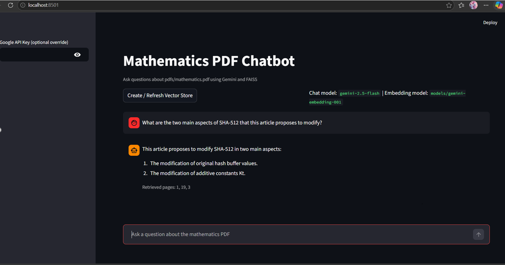

# AI RAG System - Mathematics PDF Chatbot

[](https://python.org)
[](https://streamlit.io)
[](https://langchain.com)
[](https://ai.google.dev)


A **Retrieval-Augmented Generation (RAG)** chatbot that answers questions about a mathematics PDF using Google's Gemini AI, FAISS vector search, and LangChain orchestration.

## Table of Contents
- [Features](#features)
- [Demo](#demo)
- [Tech Stack](#tech-stack)
- [Installation](#installation)
- [Usage](#usage)
- [Recent Updates](#recent-updates)
- [Project Structure](#project-structure)
- [Author](#author)

##  Features

- **PDF Processing** - Loads and processes mathematics PDF documents
- **Semantic Chunking** - Uses intelligent chunking instead of fixed-size chunks
- **Vector Search** - FAISS-based similarity search for relevant context
- **Gemini AI Integration** - Uses Gemini 2.5 Flash for chat and Gemini Embedding 2 for vectors
- **Interactive UI** - Clean Streamlit chat interface with conversation history
- **Secure API Key Management** - Uses `.env` file for sensitive credentials

## Demo

### Chat Interface


### Sample Interaction

**Question:** *"What is the main goal of the proposed mathematical model?"*

**Answer:** The main goal of the proposed mathematical model is to improve SHA-512 security without increasing complexity.

**Retrieved pages:** 1, 19, 5

---

**Question:** *"What are hash functions and why are they important?"*

**Answer:** Hash functions do not need any key and protect data using a one-way function. They map an arbitrary size input into an output of fixed length hash values or message digest. Hash functions are important because they play roles in message authentication, integrity protection, digital signatures, and blockchain.

##  Tech Stack

| Category | Technology |
|----------|------------|
| **Framework** | Streamlit |
| **LLM** | Google Gemini 2.5 Flash |
| **Embeddings** | Google Gemini Embedding 2 (preview) |
| **Vector Store** | FAISS |
| **Orchestration** | LangChain |
| **Chunking** | SemanticChunker (LangChain Experimental) |
| **PDF Processing** | PyPDFLoader |

##  Installation

### Prerequisites
- Python 3.11 or higher
- Google Gemini API key ([Get it here](https://aistudio.google.com/))

### Steps

1. **Clone the repository**
```bash
git clone https://github.com/tharindinuja-lang/ai-rag-assignment.git
cd ai-rag-assignment
